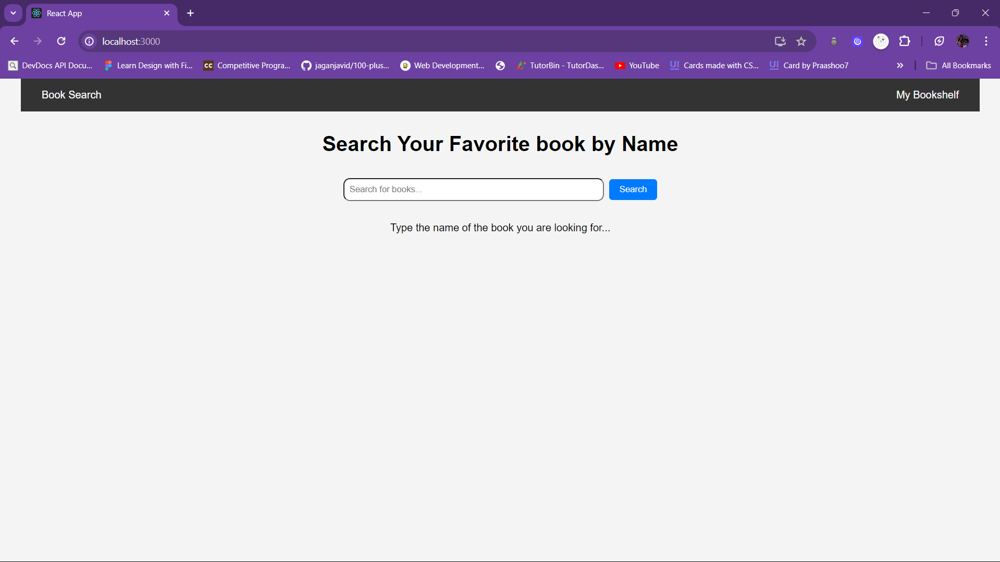
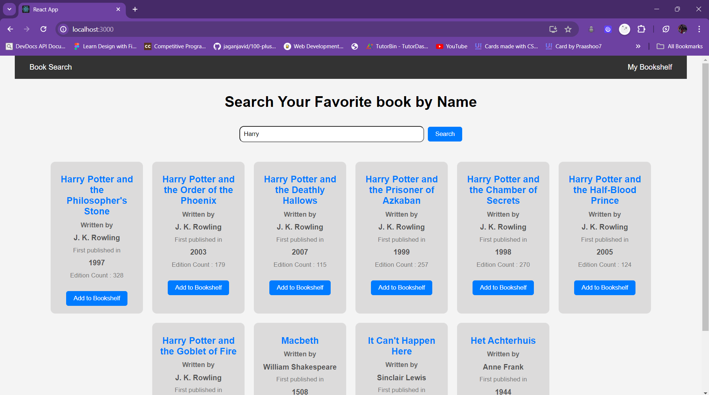
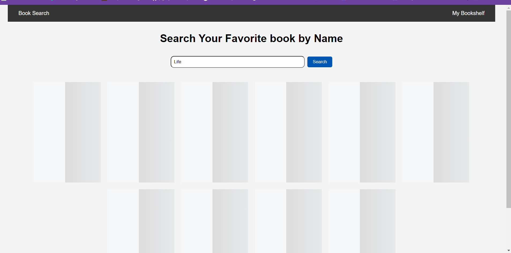
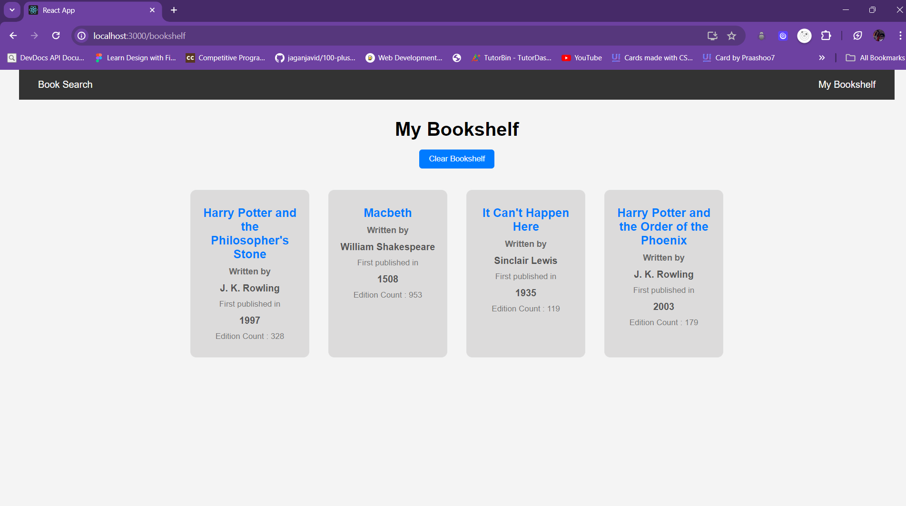

## Search Book
- This is a simple search book application made using Open Library API for fetching results.
- You can search the name of you favorite book and it will show top 10 result present on the API.
- User can add the books to their bookshelf. 
- This feature is created using the  Web Storage API (localStorage) whcih uses the browser's storage to store locally.

## Setting Up the Project Locally

1. **Clone the Repository**: 
    - Clone the repository to your local machine using Git.
    ```bash
    git clone <repository-url>
    ```

2. **Navigate to Project Directory**: 
    - Navigate to the project directory.
    ```bash
    cd book-search-app
    ```

3. **Install Dependencies**:
    - Use npm or yarn to install project dependencies.
    ```bash
    npm install
    ```
    or
    ```bash
    yarn install
    ```

## Running the Application on a Local Machine

Once the project is set up, you can run the application using the following steps:

1. **Start the Development Server**:
    - Run the development server using npm or yarn.
    ```bash
    npm start
    ```
    or
    ```bash
    yarn start
    ```

2. **Access the Application**:
    - Once the development server has started, you can access the application in your web browser by navigating to `http://localhost:3000`.












